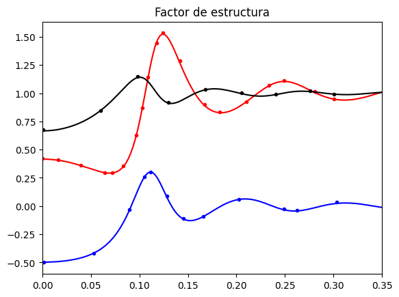

# **Calculadora de Estructura con Aproximación Esférica Media (MSA)**

Este repositorio contiene una implementación en Python para calcular las funciones de correlación directa $c_{ij}(r)$ y el factor de estructura $S_{ij}(k)$ de un sistema de electrolitos utilizando la **Aproximación Esférica Media (MSA, por sus siglas en inglés)**. El código está implementado en un Jupyter Notebook (`MSA.ipynb`) para facilitar la visualización y el análisis interactivo.

## **Descripción**

Este programa utiliza la forma analítica de la aproximación MSAresuelve las ecuaciones de la MSA para obtener las funciones de correlación y, a partir de ellas, propiedades macroscópicas del sistema.

## **Características Principales**

* **Cálculo de Funciones de Correlación**: Obtiene la función de correlación directa $c_{ij}(r)$, su transformada de fourier $c_{ij}(k)$ (con la aproximación en serie de Maclaurin para valores de $r$ pequeños) el factor de estructura $S_{ij}(k)$ empleando el método de encapsulación que describe Medina-Noyola y McQuarrie para fluidos cargados (Ec. 10 de https://doi.org/10.1063/1.441426). La derivación de esta ecuación se puede consultar en el documento _Derivación de la Ec. 10_.
* **Propiedades Termodinámicas**: Incluye el cálculo de la compresibilidad del sistema.
* **Visualización Interactiva**: Utiliza `matplotlib` para generar gráficos de alta calidad de las funciones calculadas.
* **Código Modular**: Las funciones principales están contenidas en la librería `MSAlib.py` para una fácil reutilización y mantenimiento.

---

## **Instalación**

Para ejecutar este proyecto, se recomienda crear un entorno virtual y seguir los siguientes pasos.

1.  **Clona el repositorio:**
    ```bash
    git clone https://github.com/monomonkey/MSA-Structure-Calculator.git
    cd MSA-Structure-Calculator
    ```

2.  **Crea y activa un entorno virtual:**
    ```bash
    python -m venv venv
    source venv/bin/activate  # En Windows usa `venv\Scripts\activate`
    ```

3.  **Instala las dependencias:**
    ```bash
    pip install numpy matplotlib plotly jupyterlab
    ```

---

## **Uso**

1.  Abre Jupyter Lab en tu terminal:
    ```bash
    jupyter lab
    ```
2.  Desde el navegador, abre el archivo `MSA.ipynb`.
3.  Ejecuta las celdas en orden. Puedes modificar los parámetros del sistema (concentraciones, diámetros, temperatura, etc.) en las celdas iniciales para estudiar diferentes condiciones.

---

## **Resultados de Ejemplo**

El script genera el factor de estructura la función de distribución radial $S_{ij}(k)$ para las interacciones entre las diferentes especies del sistema. La siguiente gráfica muestra una comparación entre los resultados del modelo (líneas continuas) y datos de referencia (puntos) digitalizados de la Fig. 1a del artículo de Honorina Ruiz _et al._ (https://doi.org/10.1016/0378-4371(90)90263-R), demostrando la precisión del cálculo.


